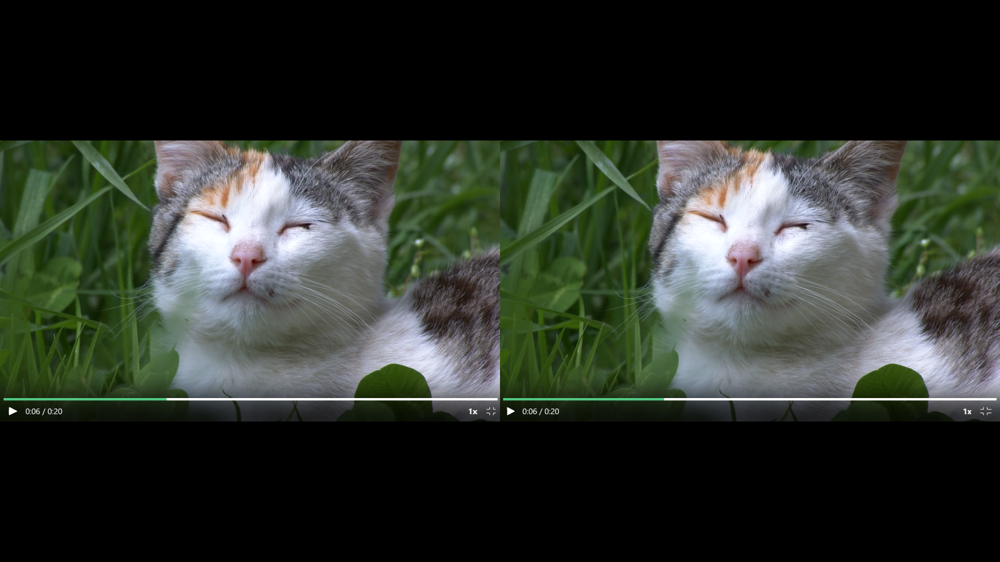

# DepthLive3D


## DepthLive3D란?

DepthLive3D는 AI 기반 깊이 매핑(depth mapping)과 OpenXR 기술을 사용하여 PC 화면을 실시간으로 3D로 변환해 VR 환경에서 볼 수 있게 해주는 무료 프로그램입니다. 오프라인 2D→3D 동영상 파일 변환 기능도 함께 제공합니다.

## 요구 사항

- **OS:** Windows 10/11 (64비트)
- **GPU:** CUDA를 지원하는 NVIDIA GPU
  - GTX 10xx 시리즈(Pascal) 이하 → CUDA 12.6
  - RTX 20xx / 30xx / 40xx / 50xx 시리즈 → CUDA 12.8
- **NVIDIA 드라이버:** 최신 드라이버 권장 (CUDA 12.6 / 12.8 지원을 위해 필요)
- **Python:** 3.12
- **Git:** 최신 버전
- **디스크 공간:** 약 10GB 여유 공간 (PyTorch, 모델 및 종속성용)
- **VR 헤드셋(선택 사항):** VR 출력을 사용할 경우 OpenXR 호환 헤드셋

---

## DepthLive3D Windows 10 & 11 빠른 설치 가이드

1. 먼저 Microsoft Visual C++ 재배포 가능 패키지 x64(vc_redist.x64.exe)를 설치하세요:
https://learn.microsoft.com/en-us/cpp/windows/latest-supported-vc-redist?view=msvc-170

2. Releases 페이지에서 DepthLive3D 설치용 CMD 스크립트를 다운로드하여 C:\DepthLive3D에 압축을 풉니다.
https://github.com/wake-82/DepthLive3D/releases/tag/VR

3. NVIDIA GTX 10 시리즈 GPU를 사용 중이라면 old-gpu-install.bat을, RTX 20 시리즈 이상이라면 new-gpu-install.bat을 실행합니다.

4. 설치가 완료되면 DepthLive3D-Run.bat 파일을 실행합니다.

5. 동영상 파일을 변환하려면 Converted 3D를, 컴퓨터 화면을 실시간으로 3D 변환하려면 Live 3D를 선택합니다.

---

## 개발 환경, 설치 및 사용법

### 1. Python 3.12와 Git 설치

### 2. 폴더 생성
```
mkdir c:\DepthLive3D
```

### 3. 폴더로 이동
```
cd c:\DepthLive3D
```

*(선택 사항)* 가상 환경 안에 설치하고 싶다면, 아래 명령어를 순서대로 실행하여 가상 환경을 활성화하세요:
```
python -m venv venv
venv\Scripts\activate
```

### 4. ZipDepth 설치
```
git clone https://github.com/fabiotosi92/ZipDepth.git
```

ZipDepth 폴더로 이동:
```
cd ZipDepth
```

ZipDepth 라이브러리 설치:
```
pip install -r requirements.txt
pip install -e .
```

### 5. DepthLive3D 라이브러리 설치
```
pip install PySide6 pywin32 dxcam PyOpenGL PyOpenGL_accelerate pyopenxr glfw psutil
```

### 6. 기본 폴더로 다시 이동
```
cd c:\DepthLive3D
```

### 7. DepthLive3D 설치
```
git clone https://github.com/wake-82/DepthLive3D.git
move C:\DepthLive3D\ZipDepth C:\DepthLive3D\DepthLive3D\
```

### 8. PyTorch(CUDA) 설치

- 구형 GPU(예: GTX 1000 시리즈, Pascal 아키텍처): `cu126`
- 신형 GPU(예: RTX 20/30/40/50 시리즈): `cu128`

CPU 버전 제거:
```
pip uninstall torch torchvision torchaudio -y
```

자신의 그래픽 카드에 맞는 줄 하나만 실행하세요:
```
pip install torch torchvision --index-url https://download.pytorch.org/whl/cu126
pip install torch torchvision --index-url https://download.pytorch.org/whl/cu128
```

GPU 버전이 올바르게 설치되었는지 확인(만약 CPU 버전이 설치되었다면 재설치):
```
python -c "import torch; print(torch.__version__); print(torch.cuda.is_available())"
```

출력 예시:
```
2.11.0+cu128
True
```

### 9. 프로그램 실행
```
cd c:\DepthLive3D\DepthLive3D
python DepthLive3D.py
```

가상 환경 안에 설치했다면 아래와 같이 실행하세요:
```
cd c:\DepthLive3D\
venv\Scripts\activate
cd c:\DepthLive3D\DepthLive3D
python DepthLive3D.py
```

### 10. 변환 시작
동영상 파일을 변환하려면 Converted 3D를, 컴퓨터 화면을 실시간으로 3D 변환하려면 Live 3D를 선택합니다.

---

## Live 3D 옵션

- **Mode** — OpenXR, PC, Dual-Monitor 3D Output 모드 중에서 선택합니다.<br> VR 기기를 사용한다면 OpenXR을, 3D TV·AR 글래스·일반 모니터를 사용한다면 PC 또는 Dual-Monitor 3D Output을 선택하세요.<br> Dual-Monitor 3D Output 모드는 외부 모니터 또는 가상 모니터가 필요합니다.
- **Process Size** — 캡처 해상도를 설정합니다. 720p 또는 1080p를 권장합니다.
- **Target FPS** — 캡처 프레임 속도를 설정합니다. 30 또는 60 중에서 선택할 수 있습니다. 프레임 속도가 불안정하다면 30으로 전환해 보세요.
- **Input Monitor** — 캡처할 모니터를 선택합니다. 메인 모니터는 `0`으로 설정하세요.
- **Output Monitor** — Dual-Monitor 3D Output 모드에서 활성화됩니다.<br> Input Monitor에서 캡처할 모니터를, Output Monitor에서 3D 변환 결과를 표시할 모니터를 선택하세요.
- **Dynamic Resolution Auto Adjust** — Process Size 설정을 기준으로 해상도를 동적으로 자동 조정합니다. 활성화하면 리사이징 과정을 건너뛰어 프레임 속도가 향상됩니다.
- **CPU Performance** — 사용할 CPU 코어 수를 선택합니다. "High"로 설정한다고 항상 성능이 향상되는 것은 아니므로, 각 모드를 테스트하여 자신의 시스템에 맞는 설정을 찾아보세요.
- **Low VRAM Mode** — GPU VRAM 부족으로 VR 화면이 멈추거나 배경이 깜빡일 경우 활성화하세요. 이 옵션을 켜면 프레임 속도가 감소합니다.
<br>또한 이 모드는 가장 최근 프레임만 사용하므로 화면 반응 속도가 가장 빠릅니다. 따라서 게임 반응성이 중요하다면 이 모드를 활성화하는 것이 유리할 수 있습니다.
- **Auto Mode** — 활성화하면 3D Strength 값을 기준으로 Edge Fix와 Flicker Reduction이 자동으로 최적값으로 설정됩니다.
- **3D Format** — PC 모드에서 활성화됩니다. 사용 중인 기기에 맞는 3D 출력 형식을 선택하세요.
- **3D Strength** — 3D 효과의 강도를 조정합니다. 강도가 높아질수록 아티팩트와 깊이맵 깜빡임이 증가합니다. `[`와 `]` 키로 실시간 조정이 가능합니다.
- **Convergence** — 화면이 튀어나오거나 들어가 보이는 정도를 조정합니다. `0.0`에서는 배경이 평평하고 전경이 튀어나오며, `1.0`에서는 배경이 더 깊어 보이고 전경이 화면 안쪽으로 들어갑니다. `0.5`는 둘 사이의 균형점입니다.
- **Edge Fix** — 전경 객체의 가장자리를 확장합니다. 3D Strength가 높아지면 전경 형태가 왜곡될 수 있는데, Edge Fix가 이를 보정하는 데 도움을 줍니다.
- **Flicker Reduction** — 프레임을 블렌딩하여 깊이맵 깜빡임을 완화합니다. 값이 높을수록 깜빡임은 줄어들지만 잔상(고스트)이 생겨 눈이나 뇌의 피로를 유발할 수 있습니다.
- **Preserve Screen Border** — 활성화하면 화면 가장자리를 보호합니다. 높은 3D Strength 값을 사용할 때 권장됩니다.
- **Depth Resolution** — 깊이맵의 해상도를 조정합니다. 해상도가 높을수록 3D 품질은 향상되지만 프레임 속도는 낮아집니다.
- **FPS Display** — 현재 평균 변환 FPS를 화면에 표시합니다.
- **Full SBS Screen Size** — AR 글래스 사용자를 위한 옵션입니다. Full SBS(fsbs) 출력 시 화면 크기를 조정합니다.
- **VR Screen Options** — 화면 크기, 높이, 거리, 중심 위치, 배경 및 화면 초기화를 설정합니다.
- **Keyboard Hotkeys** — 각 옵션에 단축키를 지정합니다.
- **Letterbox Remove Toggle** — 레터박스를 자동으로 감지하여 제거합니다. 레터박스가 있는 영상에서 상하 여백 부분에 나타날 수 있는 아티팩트를 제거해 줍니다. Quest 사용자는 컨트롤러 입력으로 전환할 수 있고, 다른 헤드셋 사용자는 키보드 단축키를 지정해야 합니다. 오작동을 방지하려면 사용을 마친 후 반드시 이 기능을 꺼 주세요.
- **Mouse Cursor** — 컨트롤러 입력에 사용되는 마우스 커서의 크기와 색상을 조정합니다.
  - **Auto Hide** — 활성화하면 동영상 재생 중 마우스 커서가 자동으로 숨겨집니다.
- **Reset Settings** — 모든 설정을 기본값으로 복원합니다.
- **Start 3D Conversion / Stop** — 프로그램을 시작하거나 중지합니다. `ESC` 키를 2초간 누르고 있어도 프로그램을 종료할 수 있습니다.

> "재시작 필요" 알림이 뜨지 않는 옵션은 프로그램 실행 중에도 실시간으로 조정할 수 있습니다.

---

## Conversion 3D 옵션

- **Input File** — 변환할 동영상 파일을 선택합니다. 폴더를 선택하면 폴더 안의 모든 동영상을 순차적으로 변환합니다.
- **Depthmap Input File** — 원본 동영상과 깊이맵 동영상을 함께 선택하면 깊이맵 생성 과정을 건너뛰고 바로 변환을 시작합니다.
- **Output Folder** — 변환된 파일이 저장될 대상 폴더를 선택합니다.
- **Preset** — 사용자 지정 3D 설정을 저장하고 불러옵니다.
- **Output Format** — 3D 출력 형식을 선택합니다.
- **3D Options** — Live 3D 옵션 문서를 참고하세요.
- **Extract Raw Depthmap** — 체크하면 원본 깊이맵 영상을 출력 파일과 함께 내보내고 저장합니다.
- **Screen Border Protection** — Live 3D 옵션 문서를 참고하세요.
- **Use FP16** — 체크하면 FP16으로 처리하고, 체크 해제하면 FP32로 깊이맵을 생성합니다.<br> FP16은 처리 속도가 더 빠르고, FP32는 정밀도가 약간 더 높습니다.
- **Auto Mode** — 체크하면 3D 깊이 강도(depth strength) 값을 기준으로 최적화된 파라미터를 자동으로 적용합니다.
- **Video Codec** — 동영상 인코딩 코덱을 선택합니다.<br> libx는 CPU 처리를 사용하고, nvenc는 NVIDIA GPU 가속을 활용해 더 빠른 변환 속도를 제공합니다.
- **Resize Resolution** — 변환 전 동영상의 해상도를 변경합니다.
- **MKV HDR Normalize** — 체크하면 변환 시작 전 HDR 영상을 표준 영상 형식으로 다시 인코딩합니다.
- **Auto Letterbox Crop** — 상하 레터박스를 자동으로 감지하여 잘라냅니다.<br> 레터박스 영역에 자막이나 텍스트가 겹쳐 있으면 감지가 실패할 수 있습니다.
- **Pad to 16:9** — 16:9 비율이 아닌 영상에 레터박스를 추가하여 16:9 비율로 맞춥니다.<br> Auto Letterbox Crop과 함께 사용하는 것을 권장합니다.
- **Start Time, End Time** — 활성화하면 특정 시간 구간을 지정하여 영상의 일부 구간만 변환할 수 있습니다.
- **Start / Stop Buttons** — 동영상 변환 프로세스를 시작하거나 중지합니다.

---

## 컨트롤러 가이드 (Meta Quest 시리즈 컨트롤러)

| 입력 | 기능 |
|---|---|
| 아날로그 스틱(위/아래) | 마우스 스크롤 |
| 아날로그 스틱(좌/우) | 3D Strength 조정 |
| 아날로그 스틱 버튼 | 화면 위치 재중심(recenter) |
| 트리거 버튼 | 마우스 왼쪽 클릭 |
| 그립 버튼 | 그립 버튼을 누른 채 컨트롤러를 좌우로 움직이면 화면 크기를, 상하로 움직이면 화면 거리를 조정합니다. |
| A / X 버튼 | 마우스 오른쪽 클릭 |
| B / Y 버튼 | Letterbox Remove 켜기/끄기 전환 |

---

## Q&A

**Q: 레터박스 제거 기능이 작동하지 않아요.**<br>
A: 레터박스 안에 텍스트가 있거나 해상도가 표준 16:9 비율이 아닌 경우, 레터박스가 인식되지 않을 수 있습니다.

**Q: Netflix나 Disney+ 같은 스트리밍 사이트에서 화면이 검게만 보여요.**<br>
A: DRM 보호 정책으로 인해 화면 캡처가 차단된 것입니다.<br> 웹 브라우저 설정에서 하드웨어 가속을 비활성화해 보세요.

**Q: 게임 화면이 잘리거나 이상하게 표시돼요.**<br>
A: 이 앱은 화면 캡처 방식을 사용하기 때문에 전체 화면(풀스크린) 모드에서는 제대로 작동하지 않을 수 있습니다.<br> 게임의 디스플레이 설정을 '창 모드(Windowed)' 또는 '테두리 없는 창 모드(Borderless Windowed)'로 변경해 보세요.

**Q: 마우스 커서가 이상하게 보이거나, 클릭 가능한 요소 위에 올리면 사라져요.**<br>
A: Windows 설정에서 '마우스 포인터 스타일 및 색' 항목으로 이동해 기본 커서로 초기화하세요.<br> 이제 정상적으로 표시될 것입니다.

**Q: 마우스 커서가 움직이지 않아요.**<br>
A: 관리자 권한이 필요한 프로그램을 실행 중인 경우, 컨트롤러의 마우스 커서가 작동하지 않습니다.<br> 컴퓨터의 실제 마우스를 사용해 해당 프로그램을 종료해 주세요.

**Q: Target FPS가 30으로 제한돼요.**<br>
A: PC 모드에서 SBS 및 TB 설정은 캡처 방식의 한계로 인해 최대 30FPS까지만 지원됩니다.

**Q: NVENC 코덱을 선택하면 변환 시작과 동시에 오류가 발생해요.**<br>
A: FFmpeg의 NVENC 코덱에 대한 드라이버 호환성은 빌드 버전에 따라 다릅니다. 최신 NVIDIA 그래픽 드라이버로 업데이트해 주세요.

**Q: Virtual Desktop 사용 시 PC 모드의 Anaglyph 출력이 작동하지 않아요.**<br>
A: PC 모드의 Anaglyph 출력은 Virtual Desktop과 같은 가상 디스플레이 환경에서 3D 렌더링을 지원하지 않습니다. 다만 Output 모드로 전환하면 Virtual Desktop에서도 anaglyph 화면을 표시할 수 있습니다.

**Q: Dual-Monitor 3D Output 모드는 어떻게 사용하나요?**<br>
A: 이 모드는 캡처용과 출력용 총 2대의 모니터가 필요합니다.<br>
사전 준비: 물리적인 모니터가 부족하다면, 가상 디스플레이 드라이버, HDMI 더미 플러그, 또는 Virtual Desktop의 가상 디스플레이 기능을 사용해 두 번째 디스플레이를 추가하세요.<br>
설정 방법: Windows 디스플레이 설정을 '확장'으로 설정한 다음, 프로그램에서 입력용과 출력용 모니터를 각각 다르게 선택하세요. (예: Input: Monitor 0 / Output: Monitor 1)<br>
주의: 동일한 모니터를 입력과 출력에 동시에 지정하지 마세요.

---

## 크레딧 (감사의 말)

이 프로젝트는 [IW3](https://github.com/nagadomi/nunif/)의 소스 코드를 사용합니다 (MIT 라이선스).<br>
이 프로젝트는 [ZipDepth](https://github.com/fabiotosi92/ZipDepth)의 소스 코드를 사용합니다 (MIT 라이선스).<br>
이 프로젝트는 [Video-Depth-Anything](https://github.com/DepthAnything/Video-Depth-Anything)의 소스 코드를 사용합니다 (Apache 2.0 라이선스).<br>

위 라이선스의 전체 원문은 `THIRD_PARTY_LICENSES/` 폴더를 참고하세요.

다음 도구들의 도움으로 제작되었습니다:
- [PyTorch](https://pytorch.org/) — BSD 계열 라이선스
- [PySide6](https://doc.qt.io/qtforpython/) — LGPLv3
- [dxcam](https://github.com/ra1nty/dxcam) — MIT 라이선스
- [OpenCV (opencv-python)](https://opencv.org/) — Apache 2.0 라이선스
- [NumPy](https://numpy.org/) — BSD 라이선스
- [PyOpenGL](http://pyopengl.sourceforge.net/) — BSD 라이선스
- [pyopenxr](https://github.com/cmbruns/pyopenxr) — Apache 2.0 라이선스, Copyright 2021 Christopher Bruns
- [glfw](https://www.glfw.org/) — zlib/libpng 라이선스
- [pywin32](https://github.com/mhammond/pywin32) — PSF 라이선스
- [psutil](https://github.com/giampaolo/psutil) — BSD-3-Clause 라이선스
- [FFmpeg](https://ffmpeg.org/) — 외부 실행 파일로 호출됨;<br>
  https://github.com/BtbN/FFmpeg-Builds 에서 받은 빌드는 GPL v3 라이선스가 적용됩니다

각 서드파티 라이브러리의 전체 라이선스 원문은 THIRD_PARTY_LICENSES/ 폴더에 포함되어 있습니다.
